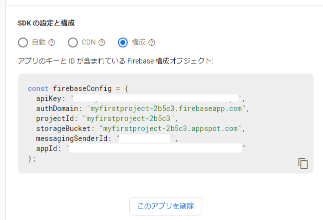

# Line風PWAチャットアプリ(React + Firestore)

## 概要
1. TypeScriptでPWAとして実装(React)。「サーバロジックは無し(クライアント側でDB登録、同期処理を実装)」

1. Line風の見た目で、複数人の投稿がリアルタイムに同期されます

1. 初回アクセス時に名前を入力すれば投稿できます。名前はlocalStorageに保存します

1. DBには「Firestore」、サーバは「Firebase Hosting」を利用しています。  (10人程度で利用する分には、無料枠で賄えます)

1. 音声入力(SpeechRecognition APIを実装しているChrome,Safariなどで利用可能)  　　https://developer.mozilla.org/ja/docs/Web/API/SpeechRecognition

1. 名前表示用のアイコンをcanvasで動的に画像を作成しています。非同期関数となるため<Suspense>を利用しています

1. ソースはcss除いて150行ほどです(動作確認のため最低限)

## 利用モジュール

create-react-app ＋ firebase を利用(下記以外に、LinterとPrettierを追加しています)

```json
  "dependencies": {
    "@types/node": "^12.0.0",
    "@types/react": "^17.0.0",
    "@types/react-dom": "^17.0.0",
    "firebase": "^8.8.0",
    "react": "^17.0.2",
    "react-dom": "^17.0.2",
    "react-scripts": "4.0.3",
    "typescript": "^4.1.2"
  }
```


## Firestoreについて

[Firebase](https://firebase.google.com/?hl=ja)とは、Google が提供しているモバイル、Webアプリ向けのバックエンドサービスです。Firestoreというリアルタイムで同期ができるNoSQLデータベースを利用します。


Firebaseプロジェクトの作成方法は下記の外部ページでご確認ください。

[[Firebase] プロジェクトを新規に作成する](https://blog.katsubemakito.net/firebase/firebase-make-newproject)


### Firestore接続設定

`.env`ファイルで設定します。

設定する内容はfirebaseのコンソールから確認します。

  

* .env

```bash
#Firebase configuration
REACT_APP_API_KEY=XXXXXXXXXXXXXXXXXXX
REACT_APP_AUTH_DOMAIN=myfirstproject-2b5c3.firebaseapp.com
REACT_APP_PROJECT_ID=myfirstproject-2b5c3
REACT_APP_STORAGE_BUCKET=myfirstproject-2b5c3.appspot.com
REACT_APP_MESSAGEING_SENDER_ID=XXXXXXXXXXXXXXXXXXX
REACT_APP_APP_ID=XXXXXXXXXXXXXXXXXXX
```


* firebaseConfig.ts

```typescript
import firebase from 'firebase';

const firebaseConfig = {
  apiKey: process.env.REACT_APP_API_KEY,
  authDomain: process.env.REACT_APP_AUTH_DOMAIN,
  projectId: process.env.REACT_APP_PROJECT_ID,
  storageBucket: process.env.REACT_APP_STORAGE_BUCKET,
  messagingSenderId: process.env.REACT_APP_MESSAGEING_SENDER_ID,
  appId: process.env.REACT_APP_APP_ID,
};

const firebaseApp = firebase.initializeApp(firebaseConfig);
const db = firebaseApp.firestore();
const auth = firebaseApp.auth();

export { auth };
export default db;
```


## ソースコード

Line風の見た目は[CSSだけでLINE風の「吹き出し」を作る方法](https://stand-4u.com/css/fukidashi.html)を参考にさせていただきました。

### html部分

チャットログは`ChatLog`型の配列です。自分の名前のログを右側に、他人を左側に表示するようにclass名を切り替えています。
```typescript
type ChatLog = {
  key: string,
  name: string,
  msg: string,
  date: Date,
};
```
* Chat1.tsx

```typescript
<>
  {/* チャットログ */}
  <div>
    {chatLogs.map((item, i) => (
      <div className={userName===item.name? 'balloon_r': 'balloon_l'} key={item.key}>
        {userName===item.name? getStrTime(item.date): '' }
        <div className="faceicon">
          
        </div>
        <div style={{marginLeft: '3px'}}>
          {item.name}<p className="says">{item.msg}</p>
        </div>
        {userName===item.name? '': getStrTime(item.date)}
      </div>
    ))}
  </div>

  {/* メッセージ入力 */}
  <form className='chatform' onSubmit={e => { e.preventDefault();submitMsg(); }}>
    <div>{userName}</div>
      <input type="text" value={msg} ref={inputMsg} onChange={(e) => setMsg(e.target.value)} />
      <input type='image' onClick={() => submitMsg} src='./img/airplane.png' alt='' />
      <input type='image' onClick={toggleListen} style={{width: '36px', height: '36px'}}
        src={listening? './img/mic-listening.png': './img/mic-stop.png'} alt='' />
  </form>
</>
```

### データ同期処理

簡略化のため保存するテーブル名(collection)は固定です。

チャットルームのリファレンス(`messagesRef`)を取得して、最新10件を取得します。

`onSnapshot()`で変更イベントを受け取ります。別の人が追加したチャットメッセージを受け取り、ログに追加します。

   * 削除、更新イベントも発生しますが、動作に影響ないため追加のみを処理します。

```typescript
  const [chatLogs, setChatLogs] = useState<ChatLog[]>([]);
  const messagesRef = useMemo(() => db.collection("chatroom").doc("room1").collection("messages"), []);

  useEffect( () => {
    // 同期処理イベント（最新10件をとるためdateでソート)
    messagesRef.orderBy("date", "desc").limit(10).onSnapshot((snapshot) => {
      snapshot.docChanges().forEach((change) => {
        if (change.type === "added") {
          // チャットログへ追加
          addLog(change.doc.id, change.doc.data());
          // 画面下部へスクロール
          window.scroll(0, document.documentElement.scrollHeight - document.documentElement.clientHeight)
        }
      });
    });
  },[]);
```

### チャットメッセージ追加処理

```typescript
  /**
   * チャットログに追加
   */
  function addLog(id: string, data: any) {
    const log = {
      key: id,
      ...data,
    };
    // Firestoreから取得したデータは時間降順のため、表示前に昇順に並び替える
    setChatLogs((prev) => [...prev, log,].sort((a,b) => a.date.valueOf() - b.date.valueOf()));
  }
```


### 音声認識

音声認識のため`webkitSpeechRecognition`を利用しています。
画面下部の「マイク」をクリックすると音声認識を開始し、認識後自動で投稿します。

無音状態が数秒続くと認識を停止します。

```typescript
  const recognition = useMemo<any>(() => new ((window as any).webkitSpeechRecognition)(), []);

  useEffect( () => {
    recognition.lang = 'ja-JP';

    // 音声認識時イベント。認識したメッセージを送信する。
    recognition.onresult  = (e: any) => {
      const transcript = e.results[0][0].transcript;
      if (transcript) {
        recognition.stop();
        setMsg(transcript);
        inputMsg.current.focus();
        submitMsg(transcript)
      }
      console.log(transcript);
    };
```


### OffscreenCanvasで描画した画像を表示

  OffscreenCanvasで画像化する場合、async関数となるため表示が面倒になります。このような場合、React.Suspenseを使うとすっきりとしたコードにすることができます。

* Canvasの場合

  非同期処理が不要なためのsrcに直接埋め込むことができます

```typescript
const createImage = () => {
  // 描画部分は省略
  var imageUrl = canvas.toDataURL( "image/jpeg", 0.75 ) ;
  return imageUrl;
}

const ImageTag: VFC = () => {
   return ;
};
```

* OffscreenCanvasの場合

  非同期処理となるためuseEffect()を利用した副作用で処理する必要がありますが、Suspenseを利用すると、すっきりとしたコードにすることができます。


```typescript
const createImage = () => {
  // 描画部分は省略
  const blob = await canvas.convertToBlob();
  const imageUrl = URL.createObjectURL(blob);
  return imageUrl;
}

// Suspenceで利用するため非同期関数をラップする
// Promiseをthrowし、非同期処理完了後に必要な値を返す処理にする
// Suspence側ではPromiseをcatchし、非同期処理完了後に本来表示するタグに置き換える
const iconImage: string = undefined;
const IconMaker: VFC = () => {
  const createImageWrapper = () => {
    if (!iconImage) {
      throw createImage().then((r) => (iconImage = r));
    } else {
      return iconImage;
    }
  };

  return ;
};

const NameIcon: VFC<{ userName: string }> = ({ userName }) => (
  <Suspense fallback={<p>Loading...</p>}>
    <IconMaker />
  </Suspense>
);
```


